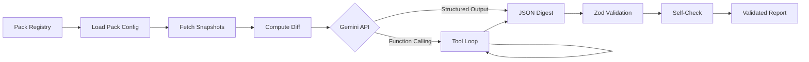

# Architecture — CivicDiff Packs

## Overview

CivicDiff Packs is a Next.js application that orchestrates Gemini API calls to analyze civic document changes. The system is designed around a **pack abstraction** — each pack is a self-contained configuration bundle that defines how to analyze a specific type of document.

## Pipeline Flow



## Key Components

### 1. Pack System (`packs/`)
Each pack directory contains:
- `pack.yaml` — Metadata, safety policy, output constraints
- `prompts/system.md` — System prompt for Gemini
- `prompts/digest_task.md` — Task prompt for digest generation
- `prompts/selfcheck_task.md` — Task prompt for self-check
- `schemas/digest.schema.json` — JSON Schema for output
- `schemas/selfcheck.schema.json` — JSON Schema for self-check
- `fixtures/snapshot_old.txt` — Old document version
- `fixtures/snapshot_new.txt` — New document version
- `golden/expected_digest.json` — Pre-computed demo output

### 2. Core Libraries (`lib/`)
- **`schemas.ts`** — Zod schemas matching the JSON schemas, with runtime validation
- **`gemini.ts`** — Gemini API client with structured output, function calling, and agentic pipeline
- **`pipeline.ts`** — Demo and live pipeline orchestration, pack loading
- **`diff.ts`** — Unified diff computation and token estimation
- **`mock-data.ts`** — Pack and report data for the UI

### 3. API Routes (`app/api/`)
- **`POST /api/analyze`** — Run demo or live pipeline for a pack
- **`POST /api/selfcheck`** — Validate a digest (local + optional AI)

### 4. UI Pages (`app/`)
- **`/`** — Dashboard with pack listing, stats, activity timeline
- **`/packs/[id]`** — Pack detail with sources, schema, analysis runner
- **`/reports/[id]`** — Report viewer with digest and raw JSON
- **`/docs`** — Architecture and usage documentation
- **`/about`** — Problem statement and approach

## Gemini Integration

### Structured Output
Every Gemini call uses `responseMimeType: "application/json"` with a full `responseSchema`. This guarantees the model outputs valid, schema-conformant JSON.

### Function Calling (Agentic)
The agentic pipeline defines 4 tools:
1. `compute_diff` — Compute unified diff between snapshots
2. `validate_candidate_json` — Validate JSON against schema
3. `extract_provenance` — Extract source reference markers
4. `persist_report` — Save validated report

Gemini orchestrates these in a loop (max 5 iterations).

### Self-Check
After digest generation, a second Gemini call validates:
- JSON validity
- Schema conformance
- Word limit compliance
- Safety policy adherence

## Data Flow

```
Input:  ~30KB (old_snapshot + new_snapshot + diff + policy)
Output: ~2KB  (structured JSON digest)
```

## Modes

| Mode | API Key | Data Source | Self-Check |
|------|---------|-------------|------------|
| Demo | Not needed | Golden JSON files | Local only |
| Live | Required | Gemini API | Local + AI |

## Security

- API keys stored in `.env.local` (gitignored)
- Safety policy enforced via system prompt per pack
- No legal advice, no political opinion, no PII processing
- All outputs validated against strict Zod schemas
